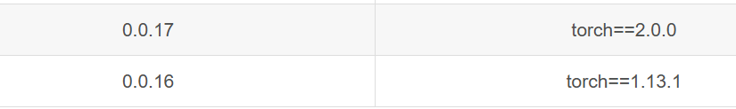

# Guide of Video-P2P

- video p2p: https://github.com/dvlab-research/Video-P2P

The video p2p project uses too old version of diffusers.

It's hard to change the version. so it's better to use the version of original code.

## problem 1: 


> ImportError: cannot import name 'cached_download' from 'huggingface_hub'

solution: 

pip install huggingface-hub==0.25.2

## problem 2  

> Numpy is not available

line:

```python
self.timesteps = torch.from_numpy(np.arange(0, num_train_timesteps)[::-1].copy())
```

solution:

pip install numpy==1.24.1

## problem 3

> unet = UNet3DConditionModel.from_pretrained_2d(pretrained_model_path, subfolder="unet")

solution:

download model.bin from the page:

https://hf-mirror.com/stable-diffusion-v1-5/stable-diffusion-v1-5/tree/main/unet


## problem 4

> xformers is not available. Make sure it is installed correctly


solution:

pip install xformers==0.0.16



pip install torchvision==0.14.1

## problem 5

> select gpu

solution:


import os
os.environ['CUDA_VISIBLE_DEVICES'] = str(7)

Then the tuning will cost about 5 minutes, which is same as the original paper.