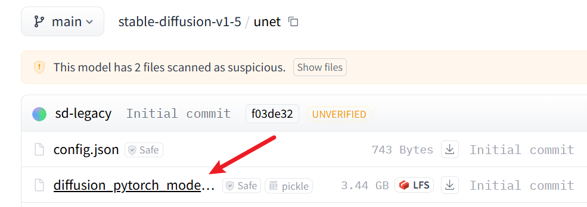

# Step-by-Step Guide to run Video-P2P

original video-p2p project: [here]([project](https://github.com/dvlab-research/Video-P2P))

## problem 1: 

> ImportError: cannot import name 'cached_download' from 'huggingface_hub'

solution: 

pip install huggingface-hub==0.25.2

## problem 2  

> Numpy is not available

line:

```python
self.timesteps = torch.from_numpy(np.arange(0, num_train_timesteps)[::-1].copy())
```

solution:

pip install numpy==1.24.1

## problem 3

> unet = UNet3DConditionModel.from_pretrained_2d(pretrained_model_path, subfolder="unet")

solution:

download model.bin from the page:

https://hf-mirror.com/stable-diffusion-v1-5/stable-diffusion-v1-5/tree/main/unet

